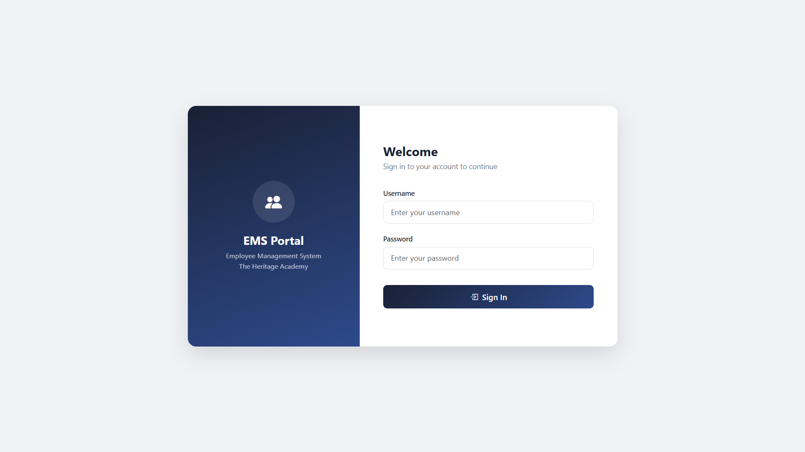
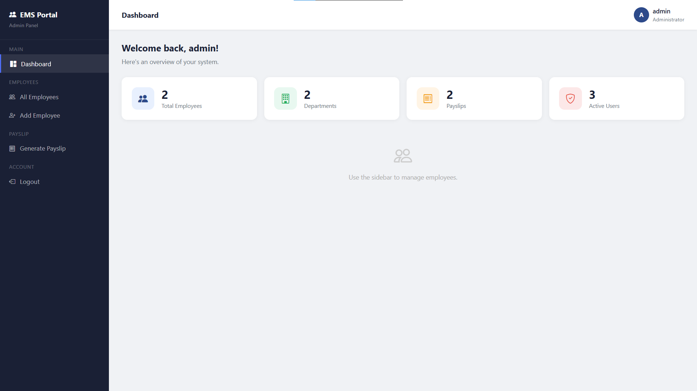
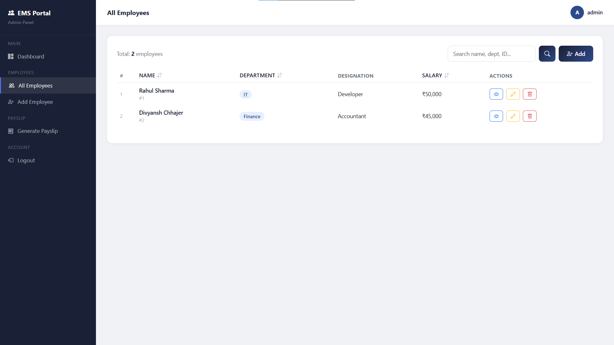
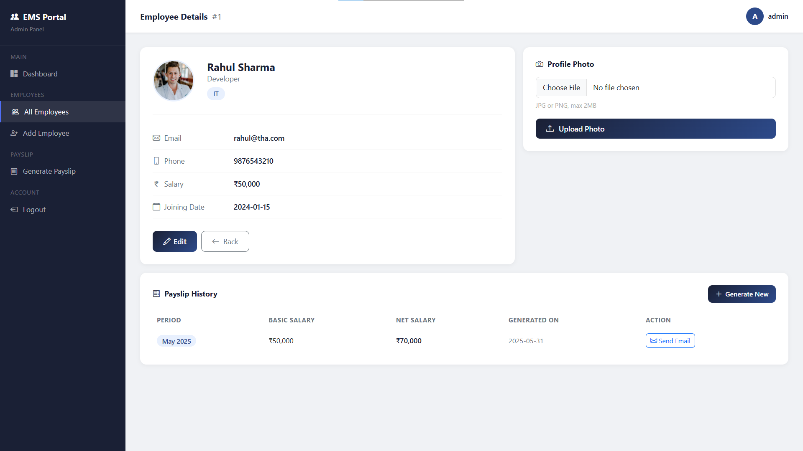
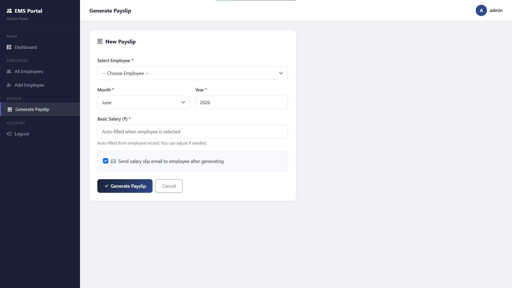
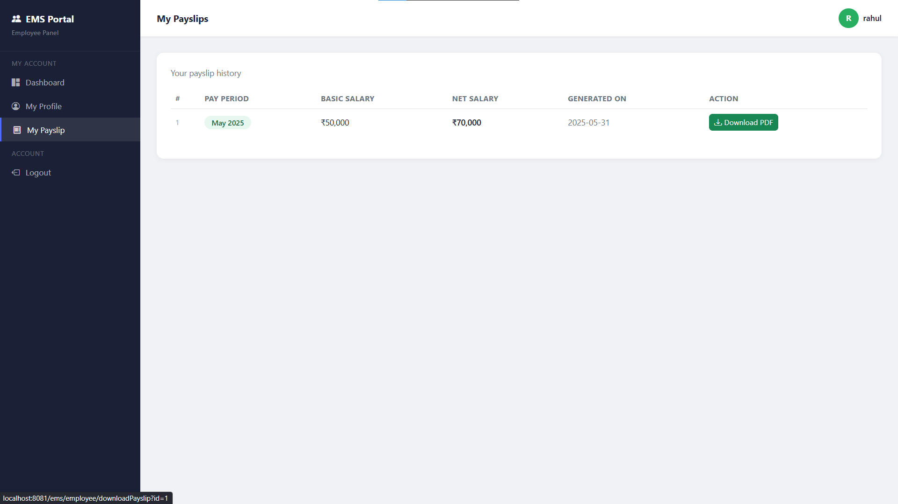

# Employee Management System (EMS)

A web-based Employee Management System developed using **Java, JSP, Servlets, JDBC, MySQL, and Apache Tomcat** as part of the **BCA Semester VI – Advanced Java with Web Application** project.

The application follows the **MVC (Model-View-Controller)** architecture and provides separate portals for **Administrators** and **Employees**.

---

## Features

### Admin Module

* Secure Login & Logout
* Dashboard with system statistics
* Add, Update, Delete Employee Records
* View Employee Details
* Search Employees
* Sort Employees by Name, Department, and Salary
* Pagination for Employee Listing
* Upload Employee Profile Photos
* Generate Payslips
* Send Payslip Notifications via Email

### Employee Module

* Secure Login & Logout
* View Personal Profile
* View Payslip History
* Download Payslips as PDF

---

## Technology Stack

| Category              | Technology                              |
| --------------------- | --------------------------------------- |
| Language              | Java 17                                 |
| Frontend              | JSP, HTML, CSS, Bootstrap 5, JavaScript |
| Backend               | Servlets                                |
| Database              | MySQL                                   |
| Database Connectivity | JDBC                                    |
| Build Tool            | Maven                                   |
| Server                | Apache Tomcat 9                         |
| Architecture          | MVC                                     |
| Email Service         | JavaMail API                            |
| PDF Generation        | OpenPDF                                 |

---

## Database

The system uses the following tables:

* `users`
* `employees`
* `payslips`

---

## Project Highlights

* MVC Architecture
* Role-Based Authentication
* Session Management
* JDBC with PreparedStatement
* CRUD Operations
* File Upload
* PDF Generation
* Email Notification
* Pagination and Sorting

---

## Installation

### Prerequisites

* JDK 17
* Apache Tomcat 9
* MySQL Server
* Maven
* Eclipse IDE (Enterprise Edition)


### Steps

1. Clone the repository

```bash
git clone https://github.com/Divyansh2905/employee-management-system.git
```

2. Import the SQL script

`database/ems_db.sql`

3. Configure database credentials in:

```text
DBConnection.java
```

4. Build the project using Maven

```bash
mvn clean install
```

5. Deploy the generated WAR file to Tomcat.

6. Open:

```text
http://localhost:8081/ems
```

---

## Email Configuration

To enable email notifications, update the email credentials inside:

`src/main/java/com/ems/util/EmailUtil.java`

Email functionality is optional and requires a valid Gmail App Password.

---

## Default Admin Credentials

|   Role   | Username | Password |
| -------- | -------- | -------- |
|  Admin   |  admin   | admin123 |
| Employee |  rahul   | rahul123 |

---

## Screenshots

<table>
<tr>
<td align="center">
<br>
<b>Login Page</b>
</td>

<td align="center">
<br>
<b>Admin Dashboard</b>
</td>
</tr>

<tr>
<td align="center">
<br>
<b>Employee List</b>
</td>

<td align="center">
<br>
<b>Employee Profile</b>
</td>
</tr>

<tr>
<td align="center">
<br>
<b>Payslip Generation</b>
</td>

<td align="center">
<br>
<b>My Payslips</b>
</td>
</tr>
</table>

## Author

**Divyansh Chhajer**

BCA Semester VI
The Heritage Academy, Kolkata

---

### Academic Project

Developed for the subject **Advanced Java with Web Application** to demonstrate Java Web Development concepts including JSP, Servlets, JDBC, Session Management, MVC Architecture, Email Integration, File Upload, and PDF Generation.
